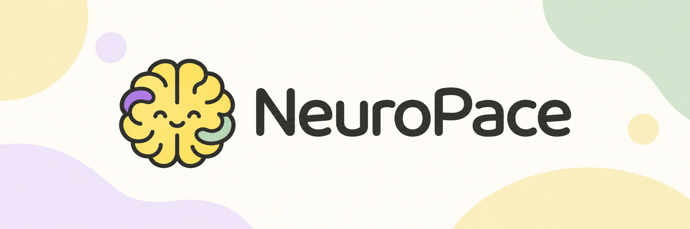

<p align="center">
  
</p>

<p align="center"><strong>The study tool that notices the moment a lecture loses you — and catches you back up.</strong></p>

<p align="center">
  
  
  
  
</p>

---

## 😵‍💫 The problem

In a lecture, your attention drifts before you notice it has. By the time you catch yourself, the class has moved on, and you're left with a gap in your notes and no idea how big it is. Rewinding a recording works if one exists; raising your hand rarely does.

## 🧠 What NeuroPace does

NeuroPace pairs a lightweight EEG headset with the live transcript of the lecture. It watches for the moments your focus actually drops — not just the moments you noticed and tapped for — flags them as they happen, and gives you a way back in immediately. After class, it turns those exact gaps into notes and a short review that keeps re-explaining each one, in a different way each time, until a quick question proves it landed.

| What happens | Why it matters |
|---|---|
| **Live catch-up** | Tap the pad, or let a focus dip trigger it, and get a one-glance recap of exactly what you missed — while it's still useful. |
| **Gap notes** | After the lecture, notes only for the spans you actually lost — what was said, the key term, how it ties back in. |
| **Adaptive review** | Each gap is re-taught — plain explanation, key term, analogy, or an animated diagram — until you get a check question right three times in a row. |
| **Your playbook** | NeuroPace learns which explanation style actually works for you and leads with it next time. |
| **Lecture loss map** | Anonymous, aggregated across everyone in the room: which 40 seconds of the lecture lost the most people. It grades the lecture, never a student. |

Everything works with no hardware at all — a simulated headset and a keyboard totem stand in for the real thing — and every simulated piece is labeled on screen as simulated. Nothing pretends to be a real reading when it isn't.

## ✨ Why it's different

Most study tools either passively record everything (so you still have to find the important part yourself) or actively quiz you with no idea what you actually missed. NeuroPace's sensor doesn't try to guess *why* you're lost or *what* to teach you — a real check question does that. The sensor's only job is *timing*: catching the moment, so nothing has to rely on you noticing it yourself.

## 🚀 Try it

```bash
uv sync && uv run neuropace serve
```

Open the printed URL, pick the demo lecture, and start a session with the simulated headset — no hardware required. Full setup (real headset, Arduino totem, API keys, hosted deployment) is in [`PLAN.md`](PLAN.md).

## 🛠️ Built with

| | |
|---|---|
| **Sensing** | NeuroSky MindWave Mobile 2 (EEG) + Arduino UNO Q 4 GB (physical "catch me up" button) |
| **Transcription** | Deepgram, live and prerecorded |
| **Explanations** | OpenAI or OpenRouter, generated fresh every time — never templated |
| **Frontend** | Vite + React |
| **Backend** | Python (FastAPI), via `uv` |

## 🔒 Privacy

There is no teacher or institutional view of any student's gap history in this product. Everything NeuroPace learns about your attention and your review history belongs to you.

## 📚 Read more

- [`PLAN.md`](PLAN.md) — the full build plan, technical reference, setup instructions, and the reasoning behind every product decision
- [`docs/PRD.md`](docs/PRD.md) — product requirements
- [`docs/TDD.md`](docs/TDD.md) — technical design (the contract every module follows)
- [`study/PROTOCOL.md`](study/PROTOCOL.md) — the study protocol behind our outcome claims

## 📄 License

MIT.
